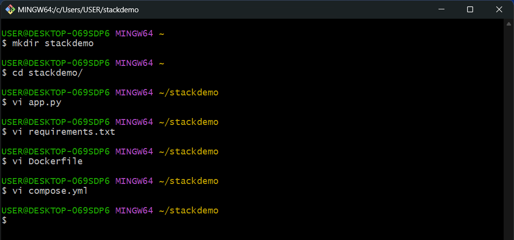

# **Follow the instructions step by step to deploy the stack to a swarm**

Here is the official [https://docs.docker.com/engine/swarm/stack-deploy/](https://docs.docker.com/engine/swarm/stack-deploy/) to practice.


## Set up a Docker registry

  ```sh
  $ docker service create --name registry --publish published=5000,target=5000 registry:2
  $ docker service ls
  $ curl http://localhost:5000/v2/
  ```
## Create the example application

  ```sh
    mkdir stackdemo
    cd stackdemo
  ```

   - [X] app.py

  ```py
    from flask import Flask
    from redis import Redis

    app = Flask(**name**)
    redis = Redis(host='redis', port=6379)

    @app.route('/')
    def hello():
        count = redis.incr('hits')
        return 'Hello World! I have been seen {} times.\n'.form (count)

    if **name** == "**main**":
        app.run(host="0.0.0.0", port=8000, debug=True)
    ```
   - [X] requirements.txt

    ```ts
      flask
      redis
    ```
   - [X] Dockerfile

    ```ts
      # syntax=docker/dockerfile:1
        FROM python:3.4-alpine
        ADD . /code
        WORKDIR /code
        RUN pip install -r requirements.txt
        CMD ["python", "app.py"]
    ```
   - [X] compose.yml

    ```ts
        services:
            web:
                image: 127.0.0.1:5000/stackdemo
                build: .
                ports:
                    - "8000:8000"
            redis:
            image: redis:alpine
    ```
    - terminal 
   
    
##  Test the app with Compose

  ```sh
   docker compose up -d
  ```
  
  ```sh
   docker compose ps
   curl http://localhost:8000
  ```
  

  ```sh
  docker compose down --volumes
  ```

## Push the generated image to the registry

  ```ts
   docker compose push
  ```

## Deploy the stack to the swarm

  ```sh
    docker stack deploy --compose-file compose.yml stackdemo
    docker stack services stackdemo
    curl http://localhost:8000
  ```
  

  ```sh
   docker stack rm stackdemo
   docker service rm registry
   docker swarm leave --force
  ```
Happy Coding!!!

